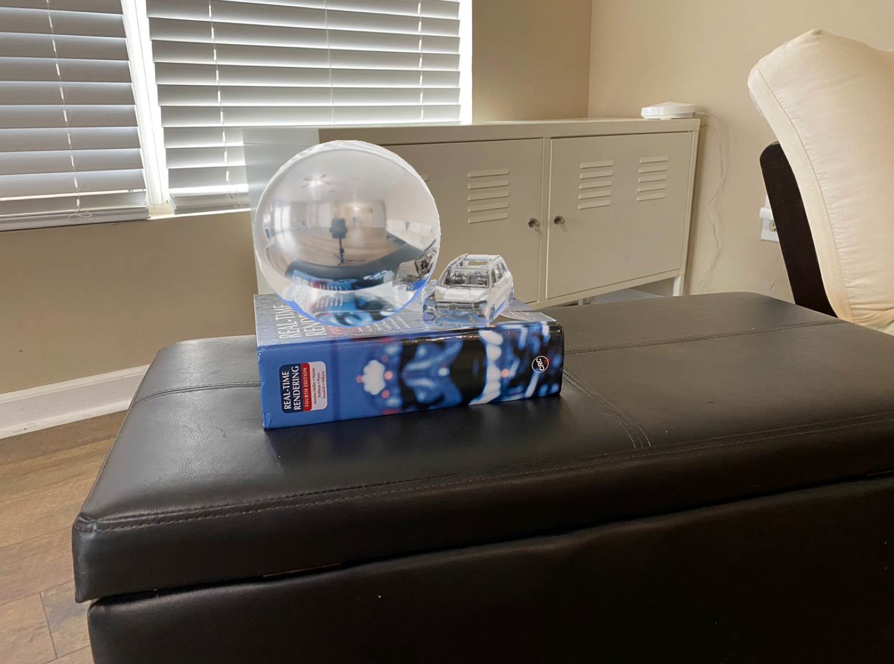

# HDR & Image-Based Lighting (IBL) Project

📄 [**Read the full report (HDR-IBL-report.pdf)**](./HDR-IBL-report.pdf)

> **R&D project exploring High Dynamic Range (HDR) imaging, Image-Based Lighting (IBL), and panoramic transformations for inserting synthetic objects into real-world scenes.**

## Overview

This repository demonstrates:
- **HDR Construction** from bracketed low dynamic range (LDR) images
- **Camera Response Function Estimation** for more accurate radiance values
- **Mirror-Ball to Equirectangular** transformations for panoramic HDR maps
- **Seamless 3D Object Compositing** using HDR environment maps in rendering software (e.g., Blender, Maya)

**Highlights:**
- **final_output.png** showcases a synthetic 3D object rendered into a real scene using environment-based lighting.
- **HDR-IBL.ipynb** walks through each step of HDR merging, IBL setup, and final compositing.
